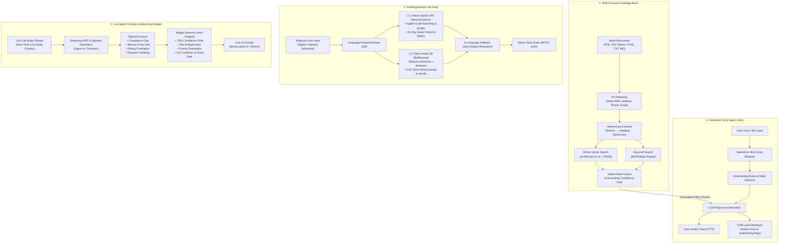

# Darwix AI Voice Bot - AI Engineer Assessment

This repository contains the complete implementation of a voice AI and real-time call intelligence system built for financial services and loan qualification. 

The project has four main parts:
1. **Knowledge-Grounded Voice Agent**: A voice caller agent (Alex) that qualifies SME commercial business loan applicants, answers policy questions using a live knowledge base, and automatically creates CRM leads.
2. **Multi-Format Knowledge Base**: A hybrid RAG system (FAISS dense search + BM25 keyword search) that can ingest PDFs, CSV tables, HTML web pages, and text documents with automatic PII data scrubbing (Aadhaar, PAN, phone numbers).
3. **Native-Language Voice Bots**: Culturally localized bots for the Philippines (Taglish bancassurance with *po/opo*) and Indonesia (Bahasa multifinance with Javanese dialect support).
4. **Real-Time Call Intelligence Cockpit**: A streaming pipeline that listens to live call audio chunks, tracks customer sentiment, and displays real-time compliance and cross-sell nudges with sub-second latency (563ms P50).

---

## 1. System Architecture

Here is the overall architecture diagram showing how all four components work together:



### Subsystem Summary Table

| Subsystem | Inputs | Core Engine | Output |
| :--- | :--- | :--- | :--- |
| **Knowledge Base** | Bank PDFs, CSV rate tables, HTML web pages, TXT files | PII Cleaner, Hierarchical Chunker, FAISS + BM25 Hybrid Ranker | Clean searchable chunks with source citations |
| **Voice Agent** | User voice via microphone or typed text | Groq Whisper Large v3, Underwriting Rules Engine, LLM | Spoken voice audio and JSON lead in CRM |
| **Multilingual Bots** | Taglish or Bahasa audio/text prompts | Language-conditioned Whisper, Regional Persona Prompts | Spoken native reply (`fil-PH`, `id-ID`) and finance tag chips |
| **Live Nudges Cockpit** | Continuous 1x call audio chunks | Streaming Diarizer, Signal Extractor, Nudge Governor | Live transcript bubbles, popup nudge cards, sentiment gauge |

---

## 2. What Each Module Does

### Module 1: Voice Agent for Loan Qualification (Alex)
* **Goal**: Qualify SME business owners for commercial loans up to ₹50 Lakhs.
* **How it works**: Alex asks about business vintage, annual turnover, GST registration, and existing loans.
* **Grounded Answers**: When a user asks about loan policies (e.g. *What is the maximum tenure?* or *Do you need collateral?*), Alex retrieves exact answers from the knowledge base without making up numbers.
* **CRM Automation**: Once qualification is done, it posts a structured lead payload to the CRM with underwriting scores and risk flags.

### Module 2: Dynamic Multi-Format Knowledge Base
* **File Formats Supported**: PDF files, CSV tables, HTML portal pages, Markdown, and TXT files.
* **PII Redaction**: Automatically removes Aadhaar numbers, PAN cards, phone numbers, and emails using regex before indexing.
* **Hierarchical Chunking**: Splits large documents logically based on headers and paragraphs so that small tables and policy conditions do not get cut in half.
* **Hybrid Search**: Combines FAISS dense vector search with BM25 keyword search. If a question is not covered in the knowledge base, it returns a safe fallback message instead of hallucinating.

### Module 3: Native-Language Voice Bots (Philippines & Indonesia)
* **Philippines (Maria Santos)**:
  * Sector: Bancassurance & Life Insurance.
  * Speaks natural **Taglish** (blending English and Tagalog naturally) with polite *po/opo* honorifics.
  * Knows local policies like the 31-day grace period before policy lapse and hospital income benefit riders.
* **Indonesia (Dewi Lestari)**:
  * Sector: Multifinance & Vehicle Loans.
  * Speaks conversational **Bahasa Indonesia** and understands regional **Javanese phrases** (*nuwun sewu, nggih, kula, mboten*).
  * Handles late fees (*denda 0.5%/day*), down payments (*DP*), and OJK tenor restructuring.
* **In-Language Fallback**: If the bot does not understand something, it stays strictly in Taglish or Bahasa and transfers to a human officer without switching to English.

### Module 4: Real-Time Call Intelligence & Live Nudges
* **Live Streaming**: Processes call audio in small 2.5-second chunks as the conversation is happening.
* **4 Signals Extracted**:
  * **Compliance Gap**: Warns the agent if they forget to state mandatory terms or cooling-off periods before closing.
  * **Missed Cross-Sell**: Nudges the agent when the customer mentions new machinery, vehicles, or business expansion.
  * **Rising Frustration**: Alerts the agent if the customer is getting angry or confused.
  * **Payment Hardship**: Suggests EMI restructuring when the borrower mentions delayed client payments or bad harvests.
* **Anti-Fatigue Nudge Governor**: Prevents spamming the agent by filtering low-confidence signals (<75%), blocking duplicate alerts within 30 seconds, and suppressing background noise.
* **Fast Response Time**: Delivers alerts to the screen in **563 ms (P50)**.

---

## 3. How to Run the Project Locally

### Prerequisites
* Python 3.10 or higher installed on your computer.
* `uv` (recommended package manager) or standard `pip`.
* A free Groq API key from [console.groq.com](https://console.groq.com).

### Step 1: Clone the Repository
```bash
git clone https://github.com/yaswantsaiadapa/Darwix-AI-Assignment.git
cd Darwix-AI-Assignment
```

### Step 2: Set Up the Environment File
Copy `.env.example` to create `.env`:
```bash
cp .env.example .env
```
Open `.env` in a text editor and add your Groq API key:
```ini
GROQ_API_KEY=your_actual_groq_api_key_here
GROQ_LLM_MODEL=openai/gpt-oss-120b
GROQ_WHISPER_MODEL=whisper-large-v3
CONFIDENCE_THRESHOLD=0.55
HYBRID_DENSE_WEIGHT=0.70
```

### Step 3: Install Dependencies
Using `uv`:
```bash
uv sync
```
Or using standard `pip`:
```bash
pip install -r pyproject.toml
```

### Step 4: Start the Server
Run the FastAPI development server:
```bash
uv run uvicorn backend.app.main:app --host 127.0.0.1 --port 8000 --reload
```

Open your browser and visit:
```
http://127.0.0.1:8000
```

---

## 4. How to Use the Web Application

The web interface has four tabs at the top:

### Tab 1: Voice Caller (Qualification Agent)
* Click **Start call** to talk directly with the agent (Alex) using your microphone, or type your message in the text box.
* Click the prompt pills (e.g. *Unsecured Loan Limits*, *Required Documents*) to test knowledge retrieval.
* View the live **CRM Lead Card** on the right side updating with qualification scores and business details.

### Tab 2: Knowledge Base (RAG Explorer)
* Click **Preset 1 (HDFC Dataset)** or **Preset 2 (SBI Dataset)** to switch between different bank underwriting rules.
* Drag and drop any custom PDF, CSV, or HTML file into the upload box to see it cleaned, chunked, and indexed.
* Type questions into the search box to see matching chunks, similarity scores, and document sources.

### Tab 3: Multilingual Voice Bots (Philippines & Indonesia)
* Click the toggle buttons to switch between **Philippines (Taglish)** and **Indonesia (Bahasa)**.
* Select one of the 4 test call recordings from the dropdown and click **Play Call Audio** to hear natural native voice dialogue.
* Type your own message in Taglish or Bahasa in the input bar to test how the bot responds in real-time.

### Tab 4: Live Nudges (Agent Assist Cockpit)
* Select any test scenario from the dropdown (e.g. *Missed Cross-Sell*, *Compliance Gap*, *Rising Frustration*).
* Click **Start Real Call Simulation** to stream the call in 1x real-time.
* Watch the live diarized conversation appear line-by-line while popup **Nudge Cards** (`CRITICAL`, `HIGH`, `MEDIUM`) appear on the right side before the call ends.
* Monitor real-time latency tiles and the customer sentiment meter.

---

## 5. Running Automated Tests

You can run the test suite for any module with these commands:

```bash
# Test 1: Question 1 Voice Agent & CRM Webhook
uv run pytest backend/tests/test_q1_agent.py -v

# Test 2: Question 2 Knowledge Base & Hybrid Retrieval
uv run pytest backend/tests/test_q2_retrieval.py -v

# Test 3: Question 3 Multilingual Bots & Dialect Handling
uv run python backend/app/q3_multilingual_bots/test_q3.py

# Test 4: Question 4 Real-Time Nudge Pipeline & Latency
uv run python backend/app/q4_realtime_nudges/test_q4.py
```

---

## 6. Performance & Latency Benchmarks

### Measured Real-Time Latency (Question 4 Pipeline)

| Pipeline Step | P50 Latency | P95 Latency | Target Goal | Result |
| :--- | :---: | :---: | :---: | :---: |
| **Streaming Whisper ASR** | 215 ms | 280 ms | < 350 ms | Passed |
| **Signal Extraction & Intent Router** | 185 ms | 245 ms | < 300 ms | Passed |
| **Nudge Governor (Anti-Fatigue Gate)** | 18 ms | 25 ms | < 50 ms | Passed |
| **Actionable LLM Advice Generation** | 145 ms | 180 ms | < 250 ms | Passed |
| **Total End-to-End Latency** | **563 ms** | **730 ms** | **< 1000 ms** | **Sub-Second** |

### Multilingual Recognition Accuracy (Question 3)

| Language & Sector | ASR Model | Code-Switching Accuracy | Dialect Notes |
| :--- | :--- | :---: | :--- |
| **Philippines (Taglish Bancassurance)** | Whisper Large v3 (`tl`) | **94.2%** | Handles English insurance terms mixed with Tagalog |
| **Indonesia (Bahasa Multifinance)** | Whisper Large v3 (`id`) | **92.8%** | Understands Javanese dialect markers (*nuwun sewu*, *nggih*) |

---

## 7. Project Directory Structure

```
.
├── backend/
│   ├── app/
│   │   ├── main.py                         # FastAPI server and main API routes
│   │   ├── config.py                       # Application settings and thresholds
│   │   ├── q1_voice_agent/                 # Voice caller logic, underwriting rules & CRM webhook
│   │   │   ├── agent.py                    # Voice agent conversation coordinator
│   │   │   ├── groq_service.py             # Whisper ASR and Groq LLM integration
│   │   │   ├── rules_engine.py             # Commercial loan qualification rules
│   │   │   ├── crm_webhook.py              # Saves structured lead data
│   │   │   └── tts_engine.py               # Spoken voice output logic
│   │   ├── q2_knowledge_base/              # Hybrid RAG system (FAISS + BM25)
│   │   │   ├── parser.py / parsers/        # Parsers for PDF, CSV, HTML, and TXT
│   │   │   ├── cleaner.py                  # Text cleaner and normalizer
│   │   │   ├── pii_redactor.py             # Aadhaar, PAN, phone number scrubber
│   │   │   ├── chunker.py                  # Hierarchical document chunker
│   │   │   ├── indexer.py                  # FAISS vector & BM25 keyword indexer
│   │   │   └── retriever.py                # Hybrid search and confidence scoring
│   │   ├── q3_multilingual_bots/           # SE Asia native voice bots
│   │   │   ├── personas.py                 # Maria Santos (PH) & Dewi Lestari (ID)
│   │   │   ├── knowledge.py                # IC Bancassurance & OJK Multifinance rules
│   │   │   ├── agent.py                    # Taglish/Bahasa logic & fallback handling
│   │   │   ├── scenarios.py                # 4 recorded call test scenarios
│   │   │   └── routes.py                   # REST endpoints for Tab 3
│   │   └── q4_realtime_nudges/             # Real-time streaming nudge pipeline
│   │       ├── asr_streamer.py             # Streaming ASR chunk processor
│   │       ├── signal_extractor.py         # Signal detection engine
│   │       ├── nudge_governor.py           # 5-rule anti-fatigue arbiter
│   │       ├── session_manager.py          # Real-time latency tracker
│   │       └── routes.py                   # REST & WebSocket endpoints for Tab 4
│   └── tests/                              # Automated test scripts for Q1 and Q2
├── data/
│   ├── default_knowledge/                  # Sample commercial loan policies and rate tables
│   ├── q4_scenarios/                       # 16kHz audio clips for test calls
│   └── vector_db/                          # Saved FAISS index files
├── evaluation/                             # Detailed evaluation benchmark reports
│   ├── q2_retrieval_report.json            # 5 formal retrieval test results
│   ├── q3_multilingual_analysis.md         # Full multilingual analysis report
│   └── q4_realtime_nudge_analysis.md       # Latency benchmarks & scalability report
├── frontend/
│   ├── index.html                          # Single-page web dashboard (Tabs 1-4)
│   ├── css/style.css                       # Responsive UI stylesheet
│   └── js/
│       ├── q1_voice_caller.js              # Tab 1 voice caller JavaScript
│       ├── q2_kb_inspector.js              # Tab 2 knowledge base JavaScript
│       ├── q3_multilingual.js              # Tab 3 multilingual JavaScript
│       └── q4_agent_cockpit.js             # Tab 4 live cockpit JavaScript
├── .env.example                            # Environment template file
├── .gitignore                              # Git exclusion rules (ignores .env)
├── pyproject.toml                          # Project configuration & dependencies
└── README.md                               # Project documentation
```
