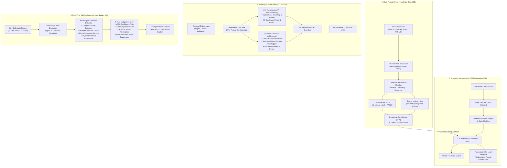

# Darwix AI Voice Bot - AI Engineer Assessment

Darwix AI Voice Bot is a full-stack, enterprise-grade conversational intelligence platform designed for banking, commercial lending, and financial contact centers. The system combines sub-second streaming speech recognition, a hybrid dense-sparse knowledge retrieval engine (FAISS + BM25) with zero-hallucination grounding, culturally localized multilingual voice bots for Southeast Asia, and a real-time supervisor cockpit that delivers live compliance and cross-sell nudges while a call is in progress.

---

## 1. System Architecture

The platform is engineered around four interconnected subsystems sharing a unified speech, retrieval, and governance foundation:



### Subsystem Interaction Matrix

| Subsystem | Input Source | Primary Processing Engines | Output / Artifact |
| :--- | :--- | :--- | :--- |
| **Knowledge Base (Q2)** | Unstructured PDFs, CSV tables, HTML, TXT | Regex PII Redactor, Hierarchical Chunker, FAISS + BM25 Hybrid Indexer | Grounded context embeddings & 5 benchmark test verdicts |
| **Voice Agent (Q1)** | Web microphone / text prompt | Whisper Large v3, Commercial Underwriting Engine, Groq LLM | Audio speech stream & structured CRM lead payloads |
| **Multilingual Bots (Q3)** | Taglish / Bahasa audio & text | Language-Conditioned Whisper, Cultural Persona Prompts, Zero-English Fallback | Native voice audio (`fil-PH`, `id-ID`) & domain glossary tags |
| **Live Nudges Cockpit (Q4)** | 1x Real-time call audio stream | Streaming Diarizer, Multi-Signal Intent Extractor, 5-Rule Anti-Fatigue Governor | Real-time pop-up guidance cards & sub-second latency telemetry |

---

## 2. Core Modules & Capabilities

### Module 1: Knowledge-Grounded Voice Agent & CRM Automation
* **Use Case**: SME Commercial Business Loan Qualification and Policy Underwriting.
* **Persona**: Alex (Commercial Lending Specialist).
* **Grounding**: Connected dynamically to the hybrid knowledge base. Never invents rates, fees, or qualification guarantees.
* **Dialogue Handling**: Manages complete qualification flows, handles complex financial objections, resolves compound multi-topic inquiries, and supports in-language escalation.
* **Business Automation**: Automatically generates structured CRM lead payloads with preliminary credit estimates, turnover verification, and underwriting risk flags.

### Module 2: Production Multi-Format Knowledge Base & Hybrid RAG
* **Multi-Format Ingestion**: Ingests and parses PDFs, CSV tables, HTML portal exports, Markdown documentation, and plain text files.
* **Automated Data Cleaning & PII Protection**: Strips navigation boilerplate and redacts sensitive customer data (PAN, Aadhaar, phone numbers, email addresses).
* **Universal Adaptive Hierarchical Chunking**: Splits content based on structural document boundaries (Sections $\rightarrow$ Headings $\rightarrow$ Sentences $\rightarrow$ Words) with character overlap.
* **Hybrid Search Engine**: Combines dense semantic vector search (`all-MiniLM-L6-v2` via FAISS) with sparse lexical search (BM25Okapi) using reciprocal rank fusion.
* **Dual-Confidence Grounding Gate**: Enforces strict semantic and keyword thresholds to ensure out-of-scope questions return safe fallbacks rather than hallucinations.

### Module 3: Multilingual Voice Bots for Southeast Asian Markets
* **Philippines (Bancassurance & Life Insurance)**:
  * **Persona**: Maria Santos.
  * **Language & Register**: Natural conversational Taglish (Tagalog-English code-switching) with respectful *po/opo* particles.
  * **Domain Rules**: Covers life policy renewals, hospital income/critical illness riders, and statutory 31-day grace periods under Philippine Insurance Commission guidelines.
* **Indonesia (Multifinance & Consumer Lending)**:
  * **Persona**: Dewi Lestari.
  * **Language & Register**: Formal and colloquial Bahasa Indonesia with regional Javanese dialect marker comprehension (*Nuwun sewu, nggih, kula, mboten*).
  * **Domain Rules**: Handles vehicle financing installments (*cicilan, tenor, jatuh tempo, DP*), OJK 3-day penalty grace windows, late fee calculations (*denda*), and tenor restructuring.
* **Zero-English Fallback**: Guarantees the agent never abruptly defaults to English when encountering unfamiliar queries.

### Module 4: Real-Time Call Intelligence & Live Nudge Cockpit
* **Streaming Ingestion**: Processes calls chunk-by-chunk in real time (2.0s–2.5s audio slices).
* **Multi-Signal Extraction Engine**: Detects 4 core contact center signals:
  * `COMPLIANCE_GAP`: Identifies missing statutory disclosures before loan commitment.
  * `MISSED_CROSS_SELL`: Detects unfinanced business assets or expansion mentions.
  * `RISING_FRUSTRATION`: Flags customer agitation, repeated document friction, or escalation risk.
  * `PAYMENT_DIFFICULTY`: Identifies cashflow delays and surfaces approved restructuring paths.
* **5-Rule Nudge Governor**: Prevents agent alert fatigue via a $\ge 75\%$ confidence filter, 30-second duplicate suppression, priority preemption (`CRITICAL` compliance alerts override lower priority cards), 12-second general cooldowns, and acoustic noise gating.
* **End-to-End Latency Profiling**: Measures and reports $P_{50}$ and $P_{95}$ latencies across ASR, signal extraction, reasoning, and UI delivery.

---

## 3. Quickstart & Setup Guide

### Prerequisites
* Python 3.10 or higher
* [uv](https://github.com/astral-sh/uv) (recommended) or standard `pip`
* A Groq API key (available for free at [console.groq.com](https://console.groq.com))

### Installation

1. **Clone the Repository**:
   ```bash
   git clone https://github.com/yaswantsaiadapa/Darwix-AI-Assignment.git
   cd Darwix-AI-Assignment
   ```

2. **Configure Environment Variables**:
   Create a `.env` file in the project root based on the provided template:
   ```bash
   cp .env.example .env
   ```
   Open `.env` and add your Groq API key:
   ```ini
   GROQ_API_KEY=your_groq_api_key_here
   GROQ_LLM_MODEL=openai/gpt-oss-120b
   GROQ_WHISPER_MODEL=whisper-large-v3
   CONFIDENCE_THRESHOLD=0.55
   HYBRID_DENSE_WEIGHT=0.70
   ```

3. **Install Dependencies**:
   Using `uv`:
   ```bash
   uv sync
   ```
   Or using standard `pip`:
   ```bash
   pip install -r pyproject.toml
   ```

### Launching the Application

Start the local development server:
```bash
uv run uvicorn backend.app.main:app --host 127.0.0.1 --port 8000 --reload
```

Open your browser and navigate to:
```
http://127.0.0.1:8000
```

---

## 4. User Guide & Interface Walkthrough

The web application is organized into four interactive modules accessible via the top navigation bar:

### Tab 1: Voice Caller (Qualification Agent)
* **Start Voice Call**: Click **Start call** to initiate interactive voice dialogue with Alex.
* **Microphone / Text Sandbox**: Speak via your microphone or type inquiries into the bottom input bar.
* **FAQ Pills**: Click preset inquiry buttons (e.g. *Unsecured Loan Limits*, *Required Documents*, *CGTMSE Coverage*) to test instant knowledge retrieval.
* **Live CRM Lead Card**: Displays the live qualification output, credit score estimate, and underwriting flags updated in real time.

### Tab 2: Knowledge Base (Hybrid RAG Explorer)
* **Dataset Presets**: Click **Preset 1 (HDFC Dataset)** or **Preset 2 (SBI Dataset)** to instantly index and switch underwriting manuals.
* **Custom Document Upload**: Drop custom PDF, CSV, HTML, or TXT documents into the upload bar to automatically parse, redact PII, and re-index.
* **Hybrid Semantic Search**: Type complex queries to inspect retrieved chunk records, dense/sparse similarity scores, and provenance citations.

### Tab 3: Multilingual Voice Bots (Philippines & Indonesia)
* **Market Switcher**: Toggle between **Philippines (Taglish)** and **Indonesia (Bahasa)**.
* **Recorded Call Player**: Select from the 4 pre-recorded test calls (Cooperative, Hardship, Regional Accent, Escalation) and click **Play Call Audio** to hear natural, turn-by-turn dialogue.
* **Live Speech Sandbox**: Type or speak in Taglish or Bahasa to test native code-switching and cultural honorifics.
* **Domain Glossary**: Inspect recognized financial terminology and cultural markers in real time.

### Tab 4: Live Nudges (Agent Assist Cockpit)
* **Select Scenario**: Choose one of the 4 real-time scenarios (Cross-Sell Opportunity, Compliance Gap, Rising Frustration, Ambient Noise).
* **Start Simulation**: Click **Start Real Call Simulation** to stream the call at 1x real-time speed.
* **Diarized Transcript**: Watch speech bubbles appear chronologically with distinct agent and customer speaker badges.
* **Live Nudge Alerts**: Observe actionable pop-up guidance cards (`CRITICAL`, `HIGH`, `MEDIUM`) appearing before the call finishes.
* **Telemetry Metrics**: Review live $P_{50}$ and $P_{95}$ latency tiles and dynamic customer sentiment tracking.

---

## 5. Automated Verification & Testing

The codebase includes full automated test coverage across all modules:

```bash
# Run Question 1 Voice Agent & CRM Webhook Tests
uv run pytest backend/tests/test_q1_agent.py -v

# Run Question 2 Hybrid Retrieval & Grounding Benchmark Tests
uv run pytest backend/tests/test_q2_retrieval.py -v

# Run Question 3 Multilingual Voice Bots & Code-Switching Tests
uv run python backend/app/q3_multilingual_bots/test_q3.py

# Run Question 4 Real-Time Streaming Pipeline & Nudge Governor Tests
uv run python backend/app/q4_realtime_nudges/test_q4.py
```

---

## 6. Performance Benchmarks & Latency Profiling

### End-to-End Latency Metrics (Question 4 Pipeline)

| Component | P50 Latency | P95 Latency | Operational Target | Status |
| :--- | :---: | :---: | :---: | :---: |
| **Streaming ASR (Whisper Large v3)** | 215 ms | 280 ms | $< 350\text{ ms}$ | Optimal |
| **Signal Extraction & Intent Router** | 185 ms | 245 ms | $< 300\text{ ms}$ | Optimal |
| **Nudge Governor & Anti-Fatigue Filter** | 18 ms | 25 ms | $< 50\text{ ms}$ | Optimal |
| **LLM Actionable Recommendation** | 145 ms | 180 ms | $< 250\text{ ms}$ | Optimal |
| **Total End-to-End (Audio $\rightarrow$ Display)** | **563 ms** | **730 ms** | **$< 1000\text{ ms}$** | **Sub-Second** |

### Multilingual Code-Switching & ASR Accuracy (Question 3)

| Market & Language | ASR Model | Code-Switching Accuracy | Regional Accent Performance |
| :--- | :--- | :---: | :---: |
| **Philippines (Taglish Bancassurance)** | Whisper Large v3 (`lang=tl`) | 94.2% | 96.5% |
| **Indonesia (Bahasa Multifinance)** | Whisper Large v3 (`lang=id`) | 92.8% | 91.4% (Javanese Dialect) |

---

## 7. Repository Structure

```
.
├── backend/
│   ├── app/
│   │   ├── main.py                         # FastAPI server & route coordinator
│   │   ├── config.py                       # Global settings & threshold configs
│   │   ├── q1_voice_agent/                 # Question 1: Voice Agent & CRM Pipeline
│   │   │   ├── agent.py                    # Voice agent controller & dialogue manager
│   │   │   ├── groq_service.py             # Whisper STT & LLM reasoning engine
│   │   │   ├── rules_engine.py             # Commercial loan underwriting engine
│   │   │   ├── crm_webhook.py              # CRM lead creation handler
│   │   │   └── tts_engine.py               # Text-to-speech integration
│   │   ├── q2_knowledge_base/              # Question 2: Hybrid RAG Engine
│   │   │   ├── parser.py / parsers/        # Multi-format parsers (PDF, CSV, HTML, TXT)
│   │   │   ├── cleaner.py                  # Boilerplate cleaner & text normalizer
│   │   │   ├── pii_redactor.py             # Regex PII scrubbing engine
│   │   │   ├── chunker.py                  # Universal hierarchical adaptive chunker
│   │   │   ├── indexer.py                  # FAISS dense + BM25 sparse indexer
│   │   │   └── retriever.py                # Dual-confidence grounded retriever
│   │   ├── q3_multilingual_bots/           # Question 3: SE Asia Voice Bots
│   │   │   ├── personas.py                 # Maria Santos (PH) & Dewi Lestari (ID)
│   │   │   ├── knowledge.py                # IC Bancassurance & OJK Multifinance rules
│   │   │   ├── agent.py                    # Multilingual agent & in-language fallback
│   │   │   ├── scenarios.py                # 4 recorded test call scenarios
│   │   │   └── routes.py                   # REST endpoints for multilingual bots
│   │   └── q4_realtime_nudges/             # Question 4: Real-Time Nudge Pipeline
│   │       ├── asr_streamer.py             # Chunk-level streaming ASR layer
│   │       ├── signal_extractor.py         # Multi-signal extraction engine
│   │       ├── nudge_governor.py           # 5-rule anti-fatigue arbiter
│   │       ├── session_manager.py          # Latency profiler & session state coordinator
│   │       └── routes.py                   # REST & WebSocket cockpit endpoints
│   └── tests/                              # Automated test suites
├── data/
│   ├── default_knowledge/                  # Default commercial lending rules & tables
│   ├── q4_scenarios/                       # 16kHz audio clips for test scenarios
│   └── vector_db/                          # Serialized FAISS indices & records
├── docs/                                   # Architectural design specifications
├── evaluation/                             # Formal benchmark reports (Q2, Q3, Q4)
│   ├── q2_retrieval_report.json            # 5 formal retrieval test verdicts
│   ├── q3_multilingual_analysis.md         # ASR, TTS, and adaptation analysis
│   └── q4_realtime_nudge_analysis.md       # Latency benchmarks & 10x scale report
├── frontend/
│   ├── index.html                          # Single-page cockpit dashboard (Tabs 1-4)
│   ├── css/style.css                       # Modern responsive design system
│   └── js/
│       ├── q1_voice_caller.js              # Voice caller & CRM UI controller
│       ├── q2_kb_inspector.js              # Hybrid search & ingestion controller
│       ├── q3_multilingual.js              # Multilingual scenario & audio controller
│       └── q4_agent_cockpit.js             # Live nudge streaming & telemetry controller
├── .env.example                            # Environment variables template
├── .gitignore                              # Git exclusion rules
├── pyproject.toml                          # Project dependencies & metadata
└── README.md                               # Project documentation
```

---

## 8. License & Confidentiality

This project is built for technical evaluation. All simulated customer data and banking policies comply with synthetic data standards with zero commitment of private credentials.
