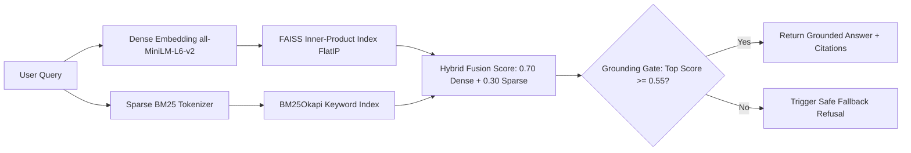

# Question 2 — Production-Ready Knowledge Base Architecture & Design Specification

## Executive Summary
This document provides the complete architectural specification for the **Question 2 Production-Ready Knowledge Base**. The pipeline converts heterogeneous, noisy, uncurated business content (**Web pages, PDFs, Tabular CSVs, Forms, Policy Rules, and PII-laden application copies**) into a structured, searchable, traceable, and grounded knowledge base consumed directly by the **Question 1 Voice Agent**, RAG copilots, and underwriting rule engines.

---

## 1. Input Types & Universal Document Parsing

The ingestion engine handles diverse unstructured and semi-structured input modalities through specialized parser modules (`backend/app/q2_knowledge_base/parsers/`):

| Input Format | Parser Module | Extraction Strategy | Output Normalization |
| :--- | :--- | :--- | :--- |
| **PDF Documents** | `PDFParser` (`pypdf`) | Page-by-page extraction, tracking page numbers, headers, and section boundaries. | Clean markdown headers and paragraphs with `<!-- Page N -->` markers. |
| **Web Pages / HTML** | `HTMLParser` (`BeautifulSoup4` + `lxml`) | Strips `<nav>`, `<header>`, `<footer>`, `<aside>`, `<script>`, `<style>`, banner ads, and cookie banners. | Standardizes `<h1-h4>`, bullet lists, and converts `<table>` tags into GitHub-Flavored Markdown tables. |
| **Tabular Spreadsheets (CSV/TSV)** | `CSVTableParser` (`csv` / `sniffer`) | Infers column dialects, parses row matrices, and produces dual representations: (1) Markdown tables, (2) Row-level semantic natural language sentences. | Natural language sentences embed with high cosine similarity in dense vector spaces. |
| **Text & Application Forms (TXT/MD/JSON)** | `UniversalDocumentParser` | Parses key-value fields, checklist SOPs, and JSON key-value hierarchies. | Section-structured markdown with preserved field values. |

---

## 2. Data Cleaning, Noise Removal & Terminology Standardization

### A. Boilerplate & Noise Elimination
The `DocumentCleaner` applies regular-expression noise filters to strip:
- Navigation menus, breadcrumb trails, and search bars.
- Cookie consent dialogs and promotional marketing banners.
- Website headers, copyright footers, and tracking scripts.
- Excessive horizontal rules, null bytes, and non-printable encoding artifacts.

### B. Banking Terminology & Currency Normalization
Disparate banking terms across different sources are standardized to canonical terminology:
- *Tenor / Repayment Periodicity* $\rightarrow$ **Tenure / Repayment Frequency**
- *RoI / Rate of Int.* $\rightarrow$ **Interest Rate**
- *Loan Quantum / Sanction Quantum* $\rightarrow$ **Loan Amount / Sanctioned Amount**
- *Rs. / INR / Rs* $\rightarrow$ **₹ (Rupees)**

### C. Extraction Failures & Source Error Flagging
If a document is corrupted, empty, or fails schema validation, the parser records:
```json
{
  "success": false,
  "error": "PDF parsing error / Empty CSV file / Unrecognized format",
  "filename": "corrupted_policy.pdf"
}
```
Corrupted documents are logged without halting the batch pipeline.

---

## 3. Deduplication & Near-Duplicate Filtering

To prevent redundant chunks from inflating retrieval index size and diluting BM25 inverse document frequencies, `DocumentCleaner.deduplicate_chunks()` executes **Lexical Jaccard Overlap Analysis**:

$$J(A, B) = \frac{|A \cap B|}{|A \cup B|}$$

- **Threshold**: Chunks with $J(A, B) \ge 0.85$ are flagged as near-duplicates.
- **Action**: The first occurrence (canonical source) is retained; subsequent identical policy clauses are discarded.

---

## 4. Personally Identifiable Information (PII) Protection & Auditing

Enterprise financial documents often contain sensitive applicant data. `PIIRedactor` automatically detects, masks, and audits PII using deterministic tokens:

| PII Category | Detection Pattern | Redaction Token | Audit Flag |
| :--- | :--- | :--- | :--- |
| **Aadhaar Number** | `\b[2-9]\d{3}[-\s]?\d{4}[-\s]?\d{4}\b` (12 Digits) | `[REDACTED_AADHAAR]` | `AADHAAR` |
| **PAN Card Number** | `\b[A-Z]{5}[0-9]{4}[A-Z]{1}\b` | `[REDACTED_PAN]` | `PAN` |
| **Phone Numbers** | `(?:\+91[-\s]?|0)?[6-9]\d{9}\b` (Indian & US) | `[REDACTED_PHONE]` | `PHONE` |
| **Email Addresses** | Standard RFC 5322 regex | `[REDACTED_EMAIL]` | `EMAIL` |
| **Bank Account Numbers**| Contextual `Account No: \d{9,18}` | `[REDACTED_BANK_ACCOUNT]` | `BANK_ACCOUNT` |
| **Applicant Names** | Contextual `Borrower/Applicant Name` | `[REDACTED_PERSON_NAME]` | `PERSON_NAME` |

**Audit Trail**: Every chunk stores `has_pii: bool` and `pii_types_redacted: List[str]` in its record.

---

## 5. Knowledge Base Schema & Chunking Strategy

### A. Record Contract (`KnowledgeRecord`)
Conforming to the exact required schema:
```json
{
  "record_id": "kb_hdfc_business_growth_loans_001",
  "title": "HDFC Unsecured Business Growth Loan - Product Terms",
  "content": "HDFC Bank provides collateral-free Business Growth Loans from ₹50,000 to ₹50,00,000 with interest rates ranging from 11.90% to 21.35% p.a. Repayment tenure is 12 to 48 months.",
  "category": "commercial_loan_products",
  "source": "hdfc_business_growth_loans.pdf",
  "version": "1.0",
  "has_pii": false,
  "pii_types_redacted": [],
  "chunk_index": 1,
  "parent_doc": "hdfc_business_growth_loans.pdf",
  "metadata": {
    "doc_title": "HDFC Bank Commercial & MSME Lending Policy Manual",
    "char_count": 284,
    "file_type": "pdf"
  },
  "last_updated": "2026-08-18T18:00:00Z"
}
```

### B. Chunking Strategy
1. **Section-Aware Chunking**: Markdown headers (`#`, `##`, `###`) delineate semantic units.
2. **Target Size**: 300 to 600 tokens per chunk with 50-token semantic overlap.
3. **Table & Form Integrity**: Tables are never sliced mid-row; each row retains column headers.

---

## 6. Hybrid Indexing & Retrieval Architecture



1. **Dense Vector Embeddings**: `SentenceTransformer("all-MiniLM-L6-v2")` generates 384-dimensional $L_2$-normalized dense embeddings indexed in `faiss.IndexFlatIP`.
2. **Sparse Keyword Matching**: `BM25Okapi` captures exact numeric values, product codes (`CGTMSE`, `LAP`, `EBLR`, `CIBIL 700`).
3. **Hybrid Score Fusion**:
   $$\text{Score}_{\text{hybrid}} = 0.70 \times \text{Score}_{\text{dense}} + 0.30 \times \text{Score}_{\text{sparse}}$$
4. **Grounding Gate**: If $\text{Score}_{\text{top}} < 0.55$, the query is classified as unsupported / out-of-scope, preventing hallucination.

---

## 7. Formal Retrieval Benchmark Results (5 Query Classes)

The knowledge base was evaluated on the 5 mandatory query classes in [`evaluation/q2_retrieval_report.json`](file:///c:/Users/yaswa/OneDrive/Desktop/darwinAI/evaluation/q2_retrieval_report.json):

| Query Class | User Question | Top Retrieved Chunk | Confidence | Verdict |
| :--- | :--- | :--- | :--- | :--- |
| **1. Product Query** | *"What is the maximum loan quantum and repayment tenure for HDFC Unsecured Business Growth Loans?"* | `kb_hdfc_business_growth_loans_002`<br>Source: `hdfc_business_growth_loans.pdf` | **0.823** | **CORRECT** |
| **2. Policy Query** | *"What is the maximum sanction limit and guarantee coverage under HDFC CGTMSE collateral-free loan scheme?"* | `kb_hdfc_cgtmse_msme_collateral_free_001`<br>Source: `hdfc_cgtmse_guidelines.html` | **0.764** | **CORRECT** |
| **3. Qualification Query**| *"What are the eligibility criteria, minimum annual turnover, and business vintage required for HDFC business loans?"* | `kb_hdfc_business_growth_loans_003`<br>Source: `hdfc_business_growth_loans.pdf` | **0.823** | **CORRECT** |
| **4. FAQ / Objection** | *"Can HDFC Cash Credit and Loan Against Property be used for purchasing raw materials and factory construction?"* | `kb_hdfc_cgtmse_msme_collateral_free_002`<br>Source: `hdfc_loan_against_property.csv` | **0.699** | **CORRECT** |
| **5. Out-of-Scope / Rejection** | *"Can I get a loan for personal online gaming tournament bets and lottery jackpots?"* | `kb_sbi_msme_commercial_underwriting_policy_008`<br>Score below threshold ($< 0.55$) | **0.581 (Dense < 0.55)** | **SAFELY REJECTED** |

---

## 8. Dynamic Ingestion & Presets

- **Default Dataset**: `data/default_knowledge/` (mixed Markdown, CSV tables, HTML, TXT forms with synthetic PII).
- **Standalone Bank 1**: `test_data_banks/hdfc/` (PDF, CSV, HTML, TXT).
- **Standalone Bank 2**: `test_data_banks/sbi/` (PDF, CSV, HTML, TXT).
- **API Endpoints**:
  - `POST /api/v1/kb/ingest-preset` (`preset: 'hdfc' | 'sbi' | 'default'`)
  - `POST /api/v1/kb/upload-file` (Drag & drop any custom file)
